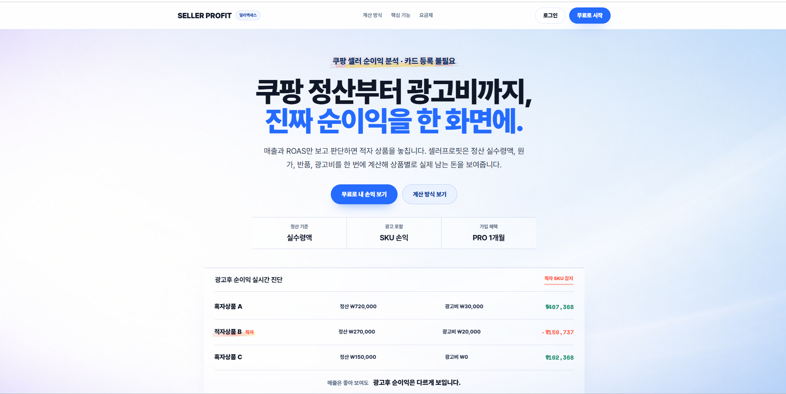
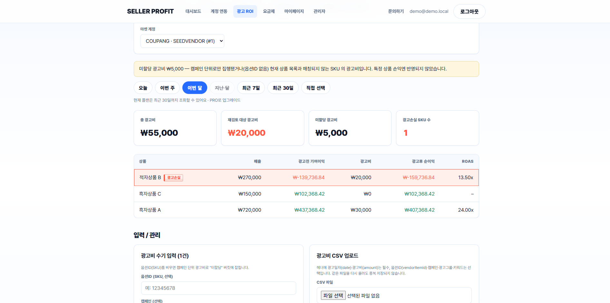
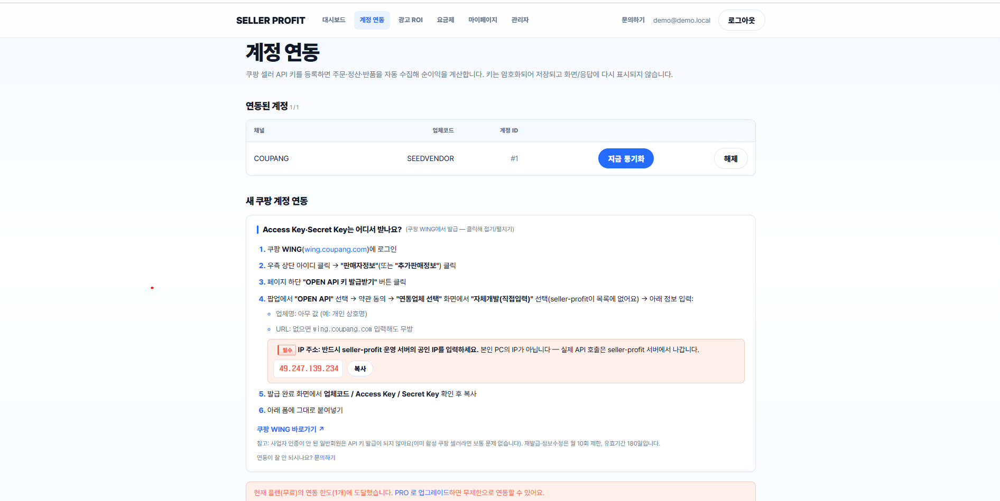
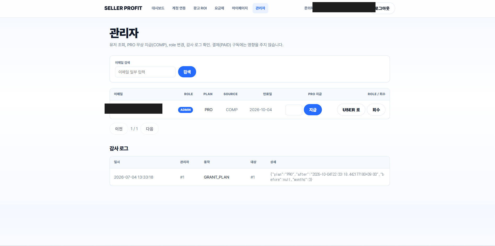

# 셀러프로핏 (seller-profit)

쿠팡 셀러의 **상품별 진짜 순이익**을 자동 계산해 [sellerprofit.co.kr](https://sellerprofit.co.kr)에서 운영 중인 SaaS.
매출·ROAS가 아니라 "정산 실수령액에서 원가·반품·광고비까지 다 뺀 뒤 실제로 얼마가 남았는가"를 상품(SKU) 단위로 보여주고, 적자 SKU를 자동으로 맨 위에 끌어올린다.

이 저장소는 1인 개발(기획·백엔드·프론트·인프라·운영 전 영역)로 진행했으며, 도메인 구매부터 실서버 배포·모니터링까지 직접 수행했다.

| | |
|---|---|
| 서비스 | 쿠팡 셀러 순이익 분석 SaaS ([sellerprofit.co.kr](https://sellerprofit.co.kr), 운영 중) |
| 기간 | 2026.06 ~ 진행 중 |
| 스택 | Java 21 · Spring Boot 3.4 · Spring Data JPA · PostgreSQL · Flyway · React 18 · Vite · Docker · Caddy(HTTPS) · Toss Payments |

```
진짜 순이익 = 정산 실수령액 − (판매수량 − 반품수량) × 개당원가 − 매출비율로 배분된 기타비용 − 광고비
```

## 배경

쿠팡 셀러 대시보드는 매출과 ROAS는 잘 보여주지만, 판매수수료·반품·광고비가 상품별로 따로 계산되지 않아 "이 상품이 실제로 돈을 버는지"는 알기 어렵다. 그 결과 매출 1등 상품이 광고를 켤수록 적자인 경우가 흔한데도 겉으로는 드러나지 않는다. 셀러프로핏은 이 격차를 상품 단위로 자동 계산해 적자 SKU를 바로 노출한다.

베타테스트 단계이며, 실제 쿠팡 셀러 계정을 연동해 도그푸딩하며 기능을 검증하고 있다.

## 스크린샷


*랜딩 페이지 — 계산 방식과 핵심 가치를 설명하는 공개 페이지.*

| 순이익 대시보드 | 광고 ROI |
|---|---|
|  |  |

*대시보드는 적자 SKU를 빨간 배경 + 뱃지로 맨 위에 고정하고 원인/개선책을 함께 제시한다(좌). 광고 ROI 화면은 ROAS가 높아도 광고후 순이익이 마이너스인 SKU를 "광고손실"로 적발한다(우).*

| 계정 연동 | 관리자 콘솔 |
|---|---|
|  |  |

*쿠팡 Open API 키 연동은 플랜별 계정 수 한도를 서버가 강제한다(좌). 관리자 콘솔에서 회원·구독·감사 로그를 관리한다(우).*

## 주요 기능

**순이익 계산**
- 정산 실수령액 기준 계산 — 주문 금액이 아니라 쿠팡이 실제로 입금한 금액에서 원가·비용을 차감
- 반품 반영 — 원가 차감 수량만 보정하고 정산 쪽 반품 반영분과 이중 차감되지 않도록 설계
- 기타비용은 매출 비율로 SKU에 배분, 적자 SKU마다 원인 진단과 개선책 문구 자동 제시

**광고 ROI**
- CSV 업로드 또는 수기 입력으로 광고비를 SKU(옵션ID)에 귀속
- 캠페인 단위로만 집행돼 특정 상품에 붙지 않는 광고비는 "미할당"으로 투명하게 분리
- ROAS와 무관하게 광고후 순이익이 마이너스인 SKU를 "광고손실"로 자동 적발

**쿠팡 연동**
- Open API HMAC 서명 연동, 주문(30분)·정산(1시간)·반품(1시간) 주기 수집 스케줄러
- 계정별 예외 격리 — 한 소스(주문/정산/반품)가 실패해도 나머지는 정상 처리되고 실패 원인만 노출
- API 키는 AES-256-GCM으로 암호화 저장, 응답·로그에 절대 노출되지 않음

**인증·보안**
- 이메일+BCrypt 세션 인증, 아이디저장·자동로그인(영속 세션 쿠키), 실제 이메일 발송 기반 비밀번호 재설정
- CSRF 더블 서브밋 쿠키, 로그인/가입/비밀번호 재설정 요청 레이트리밋, 보안 헤더, 회원 탈퇴
- 모든 본인 리소스는 소유권 검증을 거치며, 실패 시 "권한 없음"과 "존재하지 않음"을 구분하지 않아 계정 열거를 차단

**구독·과금**
- FREE/PRO 플랜, 조회 기간·연동 계정 수 한도를 서버가 강제(화면 우회 호출도 차단)
- 토스페이먼츠 정기결제 연동, 관리자용 PRO 무상 지급/회수(감사 로그 기록)

**관리자 콘솔**
- 회원·구독 현황 조회, PRO 무상 지급/회수, 관리자 행위 감사 로그
- 이메일 기반 관리자 자동 승격(`AdminBootstrapService`), 문의 폼 SMTP 발송

## 기술적 의사결정

**Spring Security 없이 만든 인증 구조라 CSRF 방어를 직접 구현했다.** `HttpSession` 기반 수제 인증을 택하다 보니 프레임워크가 주는 CSRF 방어가 전혀 없었다. 더블 서브밋 쿠키 패턴(`XSRF-TOKEN` 쿠키 발급 → 상태 변경 요청은 `X-XSRF-TOKEN` 헤더 값과 쿠키 값이 일치해야 통과)을 필터 하나로 직접 구현해, 세션 쿠키만으로 인증하는 구조의 취약점을 막았다.

**단일 인스턴스 배포라는 전제를 명시하고 트레이드오프를 감수했다.** 로그인·가입·비밀번호 재설정에 무제한 시도가 가능했던 문제를 in-memory 고정 윈도우 레이트리미터로 막았다. Redis 없이 컨트롤러에서 바로 쓸 수 있는 대신, 인스턴스를 수평 확장하면 한도가 인스턴스 수만큼 느슨해진다는 한계를 코드 주석에 명시해, 확장 시점에 반드시 교체해야 할 지점으로 남겼다.

**라이브 키 검증 중 쿠팡 정산 API의 실제 스펙 오류를 잡아냈다.** 수동 동기화를 소스별(`주문`/`정산`/`반품`)로 예외 격리해두었더니, 정산만 404("경로 불일치")로 실패하는 것을 바로 특정할 수 있었다. 문서를 재확인해 `vendorId`가 경로가 아니라 쿼리 파라미터라는 점, 응답이 평면이 아니라 `data[](주문 묶음) → items[](옵션상품 라인)` 중첩 구조라는 점을 확인해 DTO를 분리하고 멱등 키를 재설계했다. 전체가 500으로만 죽었다면 "동기화 실패"로 끝났을 문제를, 소스별 결과 격리 덕에 정확히 진단했다.

**반품과 정산이 같은 금액을 두 번 반영하지 않도록 계산 기준을 분리했다.** 원가는 `주문수량 − 반품수량`(0 미만 방지)으로 깎지만, 매출(정산 실수령액)은 쿠팡 정산 자체가 반품을 이미 음수로 반영하고 있어 추가로 차감하지 않는다. 두 값을 같은 기준으로 착각해 한쪽에서만 반영하면 이중 차감되는 함정을 명시적으로 피했다.

## 실행

로컬에 Docker와 JDK 21(툴체인 자동 다운로드 지원, JDK 25도 가능)이 필요하다. `seed` 프로파일은 포트(8088)와 개발용 암호화 키가 코드에 포함돼 있어 쿠팡 API 키 없이 바로 실행할 수 있다.

```bash
docker compose up -d                                    # 로컬 PostgreSQL
./gradlew bootRun --args='--spring.profiles.active=seed'
```

`http://localhost:8088/` 접속 → 데모 계정 `demo@demo.local` / `demo1234` 로그인 → 적자 SKU가 빨간 배경 + 뱃지로 맨 위에 보이면 정상이다.

```bash
cd frontend && npm run dev    # 프론트 개발(핫리로드), :8088 로 API 프록시
```

## 배포

운영 환경은 iwinv 서버에서 Docker Compose(PostgreSQL + Spring Boot + Caddy)로 구성돼 있으며, Caddy가 Let's Encrypt로 HTTPS를 자동 발급·갱신한다. 저장소가 비공개라 서버는 GitHub 자격증명 없이 `git archive`로 내보낸 커밋만 전달받아 빌드한다 — 서버가 저장소 접근 권한 자체를 가질 필요가 없다.

```bash
git add -A && git commit -m "..."
./deploy.sh    # git archive → 서버 전송 → 이미지 재빌드 → 무중단에 가깝게 app 컨테이너만 재기동
```

운영 시크릿(DB 비밀번호, 암호화 키 등)은 서버의 `.env.production`에만 있으며 배포 스크립트가 절대 덮어쓰지 않는다. DB는 매일 자동 백업되고 14일 보관된다.
