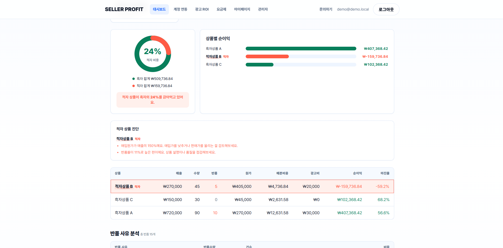

# 셀러프로핏 (seller-profit)

> 쿠팡 셀러의 **상품별 진짜 순이익(마진율)** 을 자동 계산해, **적자 상품을 맨 위로 끌어올려** 보여주는 SaaS MVP.
> 매출이 아니라 "수수료·원가·기타비용 다 빼고 실제로 얼마 남았나"가 핵심 가치다.

매출 1등 상품이 사실은 **적자**인 경우가 흔하다 — 판매수수료·반품·광고비가 상품별로 따로 떨어지지 않기 때문이다.
이 도구는 정산 실수령액에서 원가·기타비용을 빼 **상품별 실제 순이익**을 계산하고, 적자 상품을 자동으로 1순위 노출한다.

```
진짜 순이익 = 정산 실수령액 − (판매수량−반품수량)×개당원가 − 매출비율로 배분된 기타비용
```



> 📄 **설계·엔지니어링 상세는 포트폴리오 문서 → [`docs/portfolio.md`](docs/portfolio.md)**
> (문제 정의 · 아키텍처 · 보안/정합성 설계 7선 · 라이브 API 트러블슈팅 · 로드맵)

---

## 기술 스택

| 영역 | 선택 |
|------|------|
| 백엔드 | Java 21, Spring Boot 3.4 |
| DB | PostgreSQL + Flyway (멱등 마이그레이션 V1~V3) |
| 인증 | HttpSession + BCrypt |
| 키 보관 | AES-256-GCM (`@Convert` 투명 암복호화) |
| 프론트 | React 18 + Vite + React Router 6 (빌드 산출물을 Spring static 으로 → 같은 오리진) |
| 결제 | 토스페이먼츠 빌링 스캐폴딩 |
| 외부 연동 | 쿠팡 Open API (HMAC 서명, 주문/정산/반품 수집 + 스케줄러) |

---

## 바로 실행해보기 (쿠팡 키 불필요, 명령 2개)

`seed` 프로파일은 포트(8088)·개발용 암호화 키가 박혀 있어 환경변수 없이 뜬다. 흑자 2 + 적자 1 샘플이 자동 시드된다.

```bash
docker compose up -d                                   # 로컬 Postgres (5433→5432)
./gradlew bootRun --args='--spring.profiles.active=seed'
```

→ `http://localhost:8088/` 접속 → 데모 계정 `demo@demo.local` / `demo1234` 로그인
→ **적자 상품 B가 빨간 배경 + `적자` 뱃지로 맨 위**에 보이면 정상.

> 프론트 개발(핫리로드): `cd frontend && npm run dev` → `http://localhost:5173` (/api 는 :8088 프록시)

---

## 패키지 구조 (`com.sellerprofit`)

```
auth          세션 인증(BCrypt, HttpSession), 소유권 가드(CurrentUser)
account       쿠팡 계정 연동/소유권 가드, 수동 동기화
coupang       쿠팡 Open API 연동(HMAC 서명, 주문/정산/반품 수집 + 스케줄러)
profit        순이익 계산(기타비용 매출비율 배분) + 대시보드 API
manage        셀러 직접입력(원가/기타비용)
subscription  플랜 카탈로그/구독 상태(PlanType 한도)
billing       토스페이먼츠 정기결제 스캐폴딩
crypto        AES-256-GCM 키 암복호화
domain        JPA 엔티티 (User/MarketAccount/Product/OrderItem/Settlement/ReturnItem/Cost)
```

데이터 흐름: 쿠팡 API(HTTP, 트랜잭션 밖) → 페이지 단위 멱등 영속화 → 네이티브 집계쿼리(`findProfitByPeriod`)가
주문·정산·반품·원가·기타비용을 한 번에 조인해 상품별 순이익 산출 → 대시보드.

---

## 진행 현황

- [x] DB 스키마 (Flyway V1~V3) — 멱등 UNIQUE, ON DELETE CASCADE, updated_at 트리거
- [x] 도메인 엔티티 + 리포지토리 (API 키 AES-GCM 암호화)
- [x] 쿠팡 Open API 연동 — HMAC 서명 + 주문/정산/반품 수집 + 스케줄러(소스별 예외 격리)
- [x] 순이익 계산 (기타비용 매출 비율 배분, 반품 이중 차감 방지) + 대시보드 API
- [x] 인증/구독 — 세션 로그인, 플랜 한도 서버 강제, 토스 빌링 스캐폴딩
- [x] React SPA — 로그인/대시보드/계정연동/요금제, 로컬 E2E 동작
- [ ] 실 쿠팡 키 라이브 검증 (연동 입구 완성, 정산 엔드포인트 경로 404 문서 기준 수정 완료)
- [ ] 조회 기간 플랜 게이팅 · 토스 빌링 실 키 마무리

> 상세 로드맵은 [`docs/portfolio.md` §8](docs/portfolio.md) 참고.

---

## 보안 규칙

- `APP_ENCRYPTION_KEY`(Base64 32 byte)·DB 비밀번호는 **환경변수로만**. 절대 커밋 금지.
- API access/secret 키는 응답·로그에 절대 노출 안 됨 (`MarketAccount` 에 `@ToString` 미사용).
